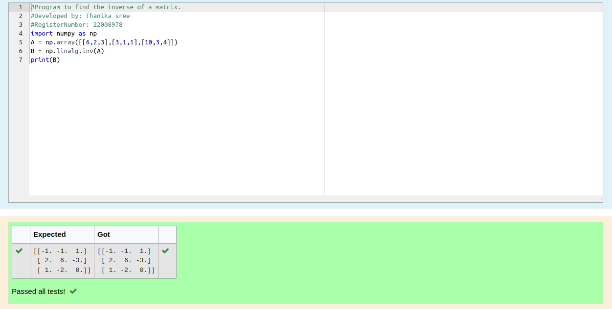

# INVERSE-OF-A-MATRIX

## Aim:
To write a python program to find the inverse of a matrix

## Equipment’s required:
1. 	Hardware – PCs
2. 	Anaconda – Python 3.7 Installation / Moodle-Code Runner

## Algorithm:

### Step 1 :
import numpy 
### Step 2: 
get the inputs
### Step 3: 
use the array function
### Step 4: 
print and end the program 

## Program:
```python
#Program to find the inverse of a matrix.
#Developed by: Thanika sree 
#RegisterNumber: 22008978
import numpy as np
A = np.array([[6,2,3],[3,1,1],[10,3,4]])
B = np.linalg.inv(A)
print(B)

```
## Output:

## Result:
Thus the inverse of given matrix is successfully solved using python program

